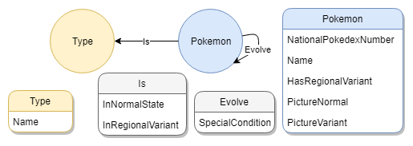

# Pokemon graph
A Pokémon graph database, baseade in the [Bulbapedia](https://bulbapedia.bulbagarden.net).

## Database model

The database has two nodes and two relationships:
1. Nodes:
    - Type: the Pokémon Type data;
    - Pokemon: the Pokémon data;
    - MegaEvolution: the mega evolution Pokémon; 
    - Form: the possible forms from the Pokémon.
2. Relationships:
    - Is: the pokemon type relationship with pokeémon;
    - Evolve: relationship between the pokemon nodes, to represent the evolutions;
    - Has: the relationship between the forms and pokémons;
    - MegaEvolve: to represent the mega evolution of pokemons.
