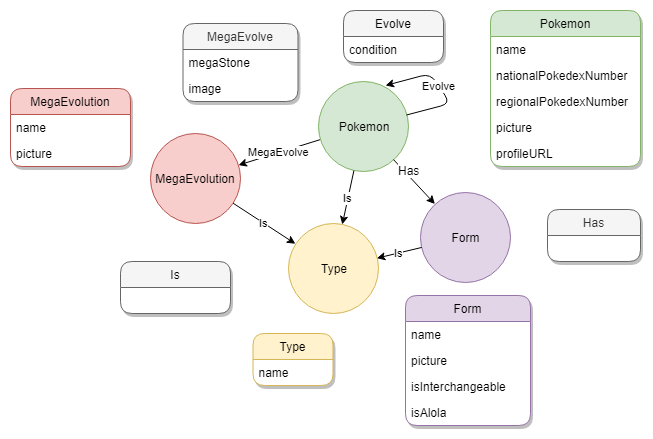

# Pokemon graph
A Pokémon graph database, baseade in the [Bulbapedia](https://bulbapedia.bulbagarden.net).

## Database model

The database has two nodes and two relationships:
1. Nodes:
    - Type: the Pokémon Type data;
    - Pokemon: the Pokémon data. 
2. Relationships:
    - Is: the pokemon type relationship with pokemon;
    - Evolve: relationship between pokemons, to represent the evolutions.